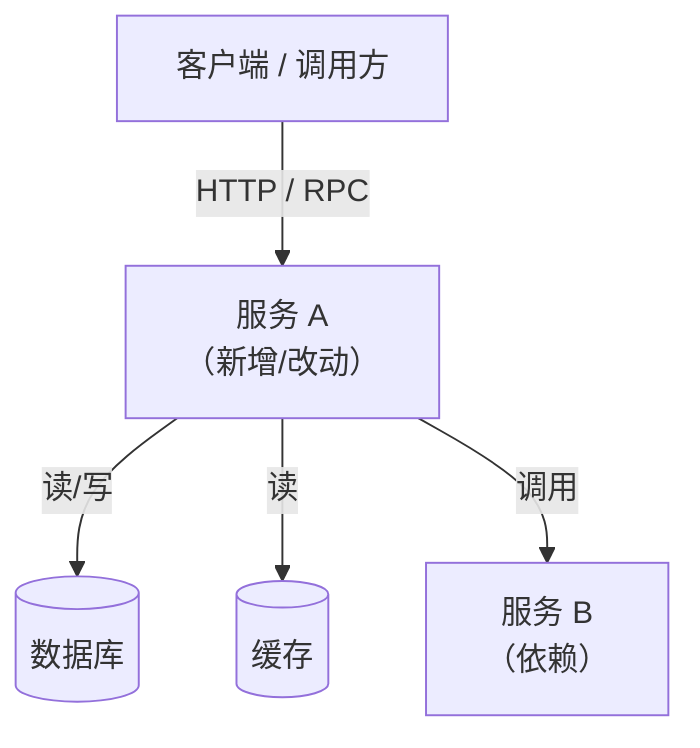
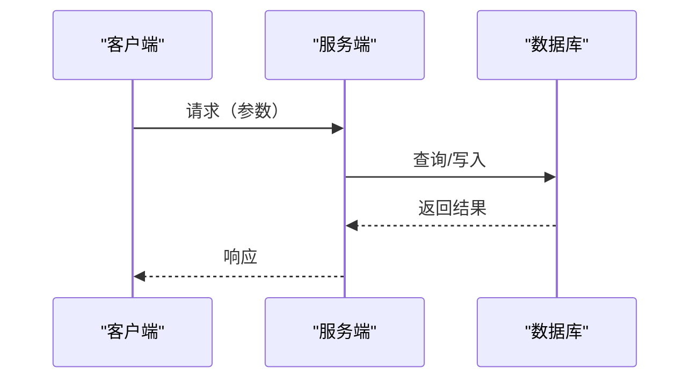

# 技术设计方案

> **文档版本**: v1.0
> **创建日期**: {{DATE}}
> **关联规格**: {{`docs/YYYY-MM-DD-feature/spec.md`}}
> **评审状态**: 🔴 待评审 / 🟡 评审中 / 🟢 已通过

---

## 1. 方案概述

### 1.1 设计目标
{{用 2-3 句话说明本方案要解决的核心技术问题，以及期望的系统行为}}

### 1.2 设计原则
- {{原则1，如：优先满足 spec.md 中的验收标准，不引入未被需求覆盖的复杂度}}
- {{原则2，如：偏向可逆决策，避免一次性锁定无法更改的架构选择}}
- {{原则3，如：接口边界最小化，组件间依赖显式声明}}

### 1.3 不在本方案范围内
- {{明确排除的技术方向或系统边界}}
- {{与 spec.md 中"不包含"对应的技术侧排除项}}

---

## 2. 架构设计

### 2.1 组件关系图



### 2.2 核心模块说明

| 模块 | 职责 | 变更类型 |
| :--- | :--- | :--- |
| {{模块名1}} | {{职责描述}} | 新增 / 修改 / 不变 |
| {{模块名2}} | {{职责描述}} | 新增 / 修改 / 不变 |

### 2.3 关键流程（时序图，如适用）



---

## 3. 数据模型

### 3.1 实体定义

#### {{实体名1}}

| 字段 | 类型 | 约束 | 说明 |
| :--- | :--- | :--- | :--- |
| `id` | `bigint` | PK, NOT NULL | 主键，自增 |
| `{{field1}}` | `{{type}}` | {{约束}} | {{说明}} |
| `{{field2}}` | `{{type}}` | {{约束}} | {{说明}} |
| `created_at` | `timestamp` | NOT NULL | 创建时间 |
| `updated_at` | `timestamp` | NOT NULL | 更新时间 |

> **索引**: `{{索引说明，如：idx_user_id on (user_id), 覆盖查询 US-01}}`

#### {{实体名2}}（如有）

| 字段 | 类型 | 约束 | 说明 |
| :--- | :--- | :--- | :--- |
| `id` | `bigint` | PK, NOT NULL | 主键 |
| `{{field1}}` | `{{type}}` | {{约束}} | {{说明}} |

### 3.2 实体关系

```
{{实体A}} 1 ──── N {{实体B}}   （一个 A 对应多个 B）
{{实体C}} N ──── N {{实体D}}   （多对多，通过关联表）
```

### 3.3 数据迁移方案（如有变更）

- {{是否需要 DDL 变更，如：新增表 / 新增字段 / 修改字段类型}}
- {{是否需要数据回填，如：存量数据迁移脚本}}
- {{回滚方案}}

---

## 4. API / 接口契约

### 4.1 {{接口名1}}

```
POST /api/v1/{{resource}}
```

**请求头**:
```
Authorization: Bearer <token>
Content-Type: application/json
```

**请求体**:
```json
{
  "{{field1}}": "{{type}} // {{说明}}",
  "{{field2}}": "{{type}} // {{说明}}"
}
```

**响应（200 OK）**:
```json
{
  "code": 0,
  "data": {
    "{{field1}}": "{{value}}",
    "{{field2}}": "{{value}}"
  },
  "message": "success"
}
```

**错误码**:
| HTTP 状态 | 业务码 | 含义 |
| :--- | :--- | :--- |
| 400 | 1001 | {{参数校验失败}} |
| 401 | 1002 | {{未认证}} |
| 404 | 1003 | {{资源不存在}} |
| 500 | 9999 | {{服务内部错误}} |

**关联 AC**: `US-01 AC-1`, `US-02 AC-2`

---

### 4.2 {{接口名2}}（如有）

```
GET /api/v1/{{resource}}/{{id}}
```

**路径参数**:
| 参数 | 类型 | 说明 |
| :--- | :--- | :--- |
| `{{id}}` | `string` | {{说明}} |

**响应（200 OK）**:
```json
{
  "code": 0,
  "data": {}
}
```

---

## 5. 关键技术决策（ADR）

### ADR-01: {{决策标题}}

| 项目 | 内容 |
| :--- | :--- |
| **状态** | 已接受 / 待评审 / 已废弃 |
| **背景** | {{面临的问题和约束，一句话说明为什么需要做这个决策}} |
| **备选方案** | 方案 A：{{描述}}；方案 B：{{描述}} |
| **决策** | 采用 {{方案X}} |
| **原因** | {{核心理由，如：方案 A 迁移成本低，且满足现有 QPS 需求}} |
| **代价/风险** | {{此决策带来的负面影响或约束}} |

---

### ADR-02: {{决策标题}}（如有）

| 项目 | 内容 |
| :--- | :--- |
| **状态** | 已接受 |
| **背景** | {{背景}} |
| **备选方案** | {{方案列表}} |
| **决策** | {{选定方案}} |
| **原因** | {{原因}} |
| **代价/风险** | {{代价}} |

---

## 6. 风险与缓解措施

| # | 风险描述 | 严重度 | 概率 | 缓解措施 | 负责人 |
| :- | :--- | :--- | :--- | :--- | :--- |
| R1 | {{风险1，如：数据迁移期间服务降级}} | 高 / 中 / 低 | 高 / 中 / 低 | {{缓解措施，如：灰度发布，先迁移 5% 流量}} | {{@负责人}} |
| R2 | {{风险2}} | 中 | 低 | {{缓解措施}} | {{@负责人}} |

---

## 7. 外部依赖

| 依赖项 | 类型 | 版本/接口 | 用途 | 联系人 |
| :--- | :--- | :--- | :--- | :--- |
| {{依赖1，如：用户服务}} | 内部 RPC / 外部 API / 三方库 | {{版本或接口地址}} | {{用途说明}} | {{@负责人}} |
| {{依赖2}} | | | | |

---

## 8. 验证方案（轻量级，如适用）

> 仅适用于 **Standard 模式**（不生成独立 `validation.md`）的场景；
> **Rigorous 模式**请略过此节，验证内容在 `validation.md` 中完整记录。

| 验收标准 | 验证方式 | 通过条件 |
| :--- | :--- | :--- |
| US-01 AC-1 | {{单元测试 / 集成测试 / 手动验证}} | {{通过条件}} |
| US-01 AC-2 | {{验证方式}} | {{通过条件}} |
| US-02 AC-1 | {{验证方式}} | {{通过条件}} |

---

## 9. 变更历史

| 版本 | 日期 | 变更内容 | 变更人 |
| :--- | :--- | :--- | :--- |
| v1.0 | {{DATE}} | 初始版本 | {{作者}} |
