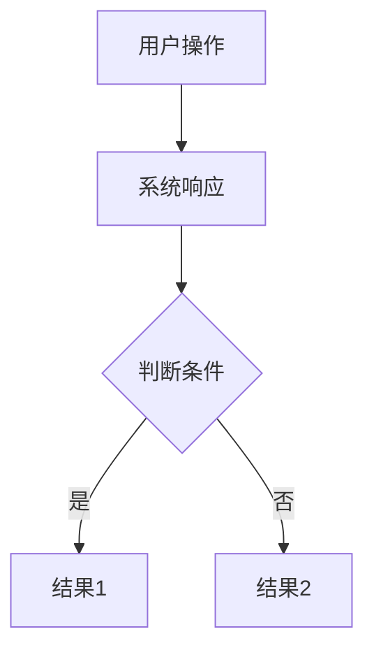

# 功能规格说明书

> **文档版本**: v1.0
> **创建日期**: {{DATE}}
> **需求来源**: {{用户提出 / 产品需求文档 / 业务反馈}}
> **基于旧规范**: {{如有，填写路径和版本号，如 `docs/2026-07-15-user-profile/spec.md v1.2`；否则填 `无`}}

---

## 1. 概述

### 1.1 背景
{{简述为什么要做这个功能，解决什么业务问题或用户痛点}}

### 1.2 目标
{{用 1-2 句话描述本次要达成的核心目标，建议格式：实现……以支持……}}

### 1.3 范围

| 包含 | 不包含 |
| :--- | :--- |
| {{功能点1}} | {{明确不做的功能1}} |
| {{功能点2}} | {{明确不做的功能2}} |

---

## 2. 用户故事

### US-01: {{故事标题}}

> **作为** {{角色}}
> **我想要** {{功能}}
> **以便于** {{价值}}

**验收标准**：
- [ ] {{标准1，可测试的具体条件}}
- [ ] {{标准2}}
- [ ] {{标准3}}

**边界条件**：
- {{异常情况1的处理方式}}
- {{边界值1的处理方式}}

### US-02: {{故事标题}}

> **作为** {{角色}}
> **我想要** {{功能}}
> **以便于** {{价值}}

**验收标准**：
- [ ] {{标准1}}
- [ ] {{标准2}}

**边界条件**：
- {{异常情况1的处理方式}}

---

## 3. 用户界面与交互（如适用）

### 3.1 页面/入口
{{描述用户如何进入该功能，入口位置、触发条件}}

### 3.2 交互流程
{{用文字或 Mermaid 流程图描述核心交互步骤}}

### 3.3 错误状态
| 场景 | 错误提示 | 处理方式 |
| :--- | :--- | :--- |
| {{场景1}} | {{提示文案}} | {{降级/重试/跳转}} |
| {{场景2}} | {{提示文案}} | {{降级/重试/跳转}} |

---

## 4. 非功能性需求

| 类别 | 要求 | 备注 |
| :--- | :--- | :--- |
| **性能** | {{如：P99 响应时间 < 200ms}} | {{测量条件}} |
| **安全** | {{如：接口需鉴权，数据脱敏}} | |
| **可用性** | {{如：服务可用率 ≥ 99.9%}} | |
| **兼容性** | {{如：支持 iOS 12+ / Android 9+}} | |
| **数据保留** | {{如：日志保留 90 天}} | |

---

## 5. 开放问题（Blockers）

| # | 问题描述 | 负责人 | 截止日期 | 状态 |
| :- | :--- | :--- | :--- | :--- |
| Q1 | {{待澄清的问题}} | {{@负责人}} | {{日期}} | 🔴 未解决 |
| Q2 | {{待澄清的问题}} | {{@负责人}} | {{日期}} | 🟡 进行中 |

> **说明**：所有开放问题必须在进入 Phase 2 之前关闭或有明确的规避方案。

---

## 6. 术语表

| 术语 | 定义 |
| :--- | :--- |
| {{术语1}} | {{在本项目中的具体含义}} |
| {{术语2}} | {{在本项目中的具体含义}} |

---

## 7. 变更历史

| 版本 | 日期 | 变更内容 | 变更人 |
| :--- | :--- | :--- | :--- |
| v1.0 | {{DATE}} | 初始版本 | {{作者}} |
