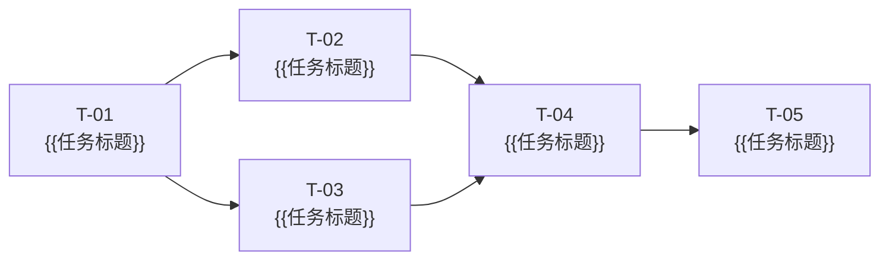

# 任务清单：{{功能名称}}

> **关联规格**: {{`docs/YYYY-MM-DD-feature/spec.md`}}
> **关联方案**: {{`docs/YYYY-MM-DD-feature/plan.md`}}
> **创建日期**: {{DATE}}
> **总任务数**: {{N}} 个 | **预估总工时**: {{N}} 小时

---

## 进度总览

> 🔴 **强约束**：每完成一个任务，必须**立即**将该任务状态更新为 `✅ done`，并同步更新下方计数。  
> 在状态更新完成之前，**不得**开始下一个任务。违反此规则视为工作流违规。

| 状态 | 数量 |
| :--- | :--- |
| ✅ 已完成 | 0 |
| 🔄 进行中 | 0 |
| ⏳ 待开始 | {{N}} |
| 🚫 被阻塞 | 0 |

---

## 依赖关系图

> **关键路径**: T-01 → T-02 → T-04 → T-05

---

## 任务列表

### 基础设施 / 数据层

---

#### T-01 · {{任务标题，使用祈使句，如：新增用户积分表}}

| 属性 | 值 |
| :--- | :--- |
| **状态** | ⏳ pending |
| **规模** | S（≤1h）/ M（1-2h）/ L（2-4h）/ XL（需拆分） |
| **依赖** | 无 |
| **关联 AC** | `US-01 AC-1`、`US-01 AC-2` |

**变更文件**：
- 🆕 `{{路径/文件名}}` — {{说明，如：新建积分表 DDL}}
- ✏️ `{{路径/文件名}}` — {{说明，如：注册新的 Repository Bean}}

**完成条件**：
- [ ] {{可独立验证的具体条件，如：DDL 脚本执行成功，表结构符合 plan.md §3.1}}
- [ ] {{条件2}}

---

#### T-02 · {{任务标题}}

| 属性 | 值 |
| :--- | :--- |
| **状态** | ⏳ pending |
| **规模** | M |
| **依赖** | T-01 |
| **关联 AC** | `US-01 AC-1` |

**变更文件**：
- ✏️ `{{路径/文件名}}` — {{说明}}

**完成条件**：
- [ ] {{条件1}}
- [ ] {{条件2}}

---

### 业务逻辑层

---

#### T-03 · {{任务标题}}

| 属性 | 值 |
| :--- | :--- |
| **状态** | ⏳ pending |
| **规模** | M |
| **依赖** | T-01 |
| **关联 AC** | `US-02 AC-1` |

**变更文件**：
- 🆕 `{{路径/文件名}}` — {{说明}}
- ✏️ `{{路径/文件名}}` — {{说明}}

**完成条件**：
- [ ] {{条件1}}
- [ ] {{条件2}}

---

#### T-04 · {{任务标题}}

| 属性 | 值 |
| :--- | :--- |
| **状态** | ⏳ pending |
| **规模** | L |
| **依赖** | T-02、T-03 |
| **关联 AC** | `US-01 AC-3`、`US-02 AC-2` |

**变更文件**：
- ✏️ `{{路径/文件名}}` — {{说明}}

**完成条件**：
- [ ] {{条件1}}
- [ ] {{条件2}}
- [ ] {{条件3}}

---

### 接口层

---

#### T-05 · {{任务标题，如：实现积分查询 API}}

| 属性 | 值 |
| :--- | :--- |
| **状态** | ⏳ pending |
| **规模** | M |
| **依赖** | T-04 |
| **关联 AC** | `US-01 AC-1`、`US-02 AC-1` |

**变更文件**：
- 🆕 `{{路径/Controller}}` — {{说明}}
- ✏️ `{{路径/Router 或路由注册}}` — {{说明}}

**完成条件**：
- [ ] {{接口可正常调用，返回结果符合 plan.md §4.1 定义的响应格式}}
- [ ] {{鉴权/参数校验通过}}

---

### 测试

> **规则**：每个功能任务必须有对应的测试任务，不得遗漏。

---

#### T-06 · 为 T-02 编写单元测试

| 属性 | 值 |
| :--- | :--- |
| **状态** | ⏳ pending |
| **规模** | S |
| **依赖** | T-02 |
| **关联 AC** | `US-01 AC-1` |

**变更文件**：
- 🆕 `{{路径/XxxTest.java 或 xxx.test.ts}}` — 单元测试

**完成条件**：
- [ ] 覆盖正常路径
- [ ] 覆盖边界条件
- [ ] 测试通过，覆盖率 ≥ {{80%}}

---

#### T-07 · 为 T-05 编写集成测试

| 属性 | 值 |
| :--- | :--- |
| **状态** | ⏳ pending |
| **规模** | M |
| **依赖** | T-05、T-06 |
| **关联 AC** | `US-01 AC-1`、`US-02 AC-1` |

**变更文件**：
- 🆕 `{{路径/集成测试文件}}` — API 集成测试

**完成条件**：
- [ ] 主流程 E2E 测试通过
- [ ] 异常分支测试通过
- [ ] CI 流水线绿色

---

## 验收标准覆盖矩阵

> 每条 AC 至少要有一个任务覆盖，否则任务清单不完整。

| 验收标准 | 覆盖任务 |
| :--- | :--- |
| US-01 AC-1 | T-01、T-02、T-05、T-06 |
| US-01 AC-2 | T-01、T-04 |
| US-01 AC-3 | T-04 |
| US-02 AC-1 | T-03、T-05、T-07 |
| US-02 AC-2 | T-03、T-04 |

---

## 质量检查清单

- [ ] `spec.md` 中每条验收标准都被至少一个任务覆盖
- [ ] 每个功能任务都有对应的测试任务
- [ ] 所有任务规模 ≤ L（XL 任务已拆分）
- [ ] 依赖关系构成有向无环图（无循环依赖）
- [ ] 每个任务都明确了文件级变更
- [ ] 任务清单已经过至少一位工程师评审
